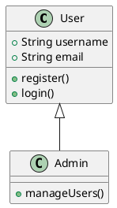
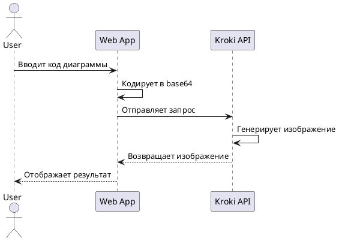

# 🎨 Kroki Визуализатор


## 📋 Описание проекта

**Kroki Визуализатор** — это веб-приложение, которое предоставляет удобный интерфейс для работы с API сервиса [Kroki.io](https://kroki.io/). Приложение позволяет создавать, редактировать и экспортировать различные типы диаграмм с помощью простого текстового описания.

Этот проект был разработан как пет-проект для демонстрации возможностей взаимодействия с внешними API и создания интуитивно понятного пользовательского интерфейса для работы с диаграммами.


## ✨ Возможности

- 📊 **Поддержка различных типов диаграмм**: PlantUML, Mermaid, GraphViz, C4 с PlantUML, BPMN и другие
- 🖼️ **Экспорт в разных форматах**: SVG, PNG, JPEG, PDF
- 📝 **Удобный редактор** с предпросмотром в реальном времени
- 🗂️ **Галерея примеров** для быстрого старта
- 📱 **Адаптивный дизайн** для комфортной работы на любых устройствах
- 🔄 **Оптимизированные запросы к API** с использованием POST-запросов для больших диаграмм

## 🚀 Быстрый старт

### Установка

1. Клонируйте репозиторий:
   ```bash
   git clone https://github.com/ternopolskiy/kroki-visualizer.git
   cd kroki-visualizer
   ```

2. Откройте файл `index.html` в вашем браузере или используйте локальный сервер:
   ```bash
   # Если у вас установлен Python
   python -m http.server
   
   # Если у вас установлен Node.js
   npx serve
   ```

### Использование

1. Перейдите на страницу **Редактор**
2. Выберите тип диаграммы из выпадающего списка
3. Введите код диаграммы в текстовое поле (или используйте предложенный пример)
4. Нажмите кнопку «Визуализировать» для отображения результата
5. При необходимости выберите формат экспорта и нажмите «Сохранить»

## 📚 Поддерживаемые типы диаграмм

| Тип диаграммы | Описание | Документация |
|--------------|----------|---------------|
| PlantUML | Язык для создания UML-диаграмм (диаграммы классов, последовательностей, состояний и др.) | [Документация PlantUML](https://plantuml.com/ru/) |
| Mermaid | Простой язык разметки для создания диаграмм из текстовых описаний | [Документация Mermaid](https://mermaid-js.github.io/mermaid/#/) |
| GraphViz | Инструмент для визуализации структурной информации в виде графов и сетей | [Документация GraphViz](https://graphviz.org/documentation/) |
| C4 с PlantUML | Модель для визуализации архитектуры программного обеспечения | [Документация C4 Model](https://c4model.com/) |
| BPMN | Нотация моделирования бизнес-процессов | [Документация BPMN](https://www.bpmn.org/) |

## 📦 Структура проекта

```
/
├── index.html          # Главная страница с описанием проекта
├── editor.html         # Страница редактора диаграмм
├── gallery.html        # Галерея примеров различных диаграмм
├── about.html          # Страница с информацией о проекте и Kroki.io
├── css/
│   ├── style.css       # Основные стили приложения
│   ├── editor.css      # Стили для страницы редактора
│   └── gallery.css     # Стили для галереи примеров
├── images/
│   ├── diagram1.svg    # Пример диаграммы 1
│   ├── diagram2.svg    # Пример диаграммы 2
│   └── diagram3.svg    # Пример диаграммы 3
├── js/
│   ├── main.js         # Основной JavaScript код приложения
│   ├── api.js          # Модуль для работы с API Kroki.io
│   ├── editor.js       # Логика работы редактора диаграмм
│   └── gallery.js      # Скрипты для галереи примеров
└── README.md           # Документация проекта
```

## 🔧 Технологии и процесс разработки

### Используемые технологии

- **HTML5** для структуры страниц и семантической разметки
- **CSS3** для стилизации и создания адаптивного дизайна
  - Использование CSS Grid и Flexbox для создания гибких макетов
  - Применение CSS-переменных для единой цветовой схемы
  - Медиа-запросы для адаптивности на различных устройствах
- **JavaScript (ES6+)** для интерактивности и работы с API
  - Fetch API для асинхронных запросов к серверу
  - Промисы и async/await для обработки асинхронных операций
  - Модульная структура кода для лучшей организации
- **API Kroki.io** для генерации диаграмм

### Процесс разработки

Проект был разработан с использованием следующего подхода:

1. **Исследование API Kroki.io**
   - Изучение официальной документации API
   - Анализ возможностей и ограничений сервиса
   - Тестирование различных типов запросов и параметров

2. **Проектирование интерфейса**
   - Создание прототипов страниц в Figma
   - Разработка единой системы дизайна и цветовой схемы
   - Планирование адаптивного поведения для различных устройств

3. **Разработка фронтенда**
   - Создание HTML-структуры страниц
   - Реализация стилей с использованием современных CSS-техник
   - Написание JavaScript-кода для взаимодействия с API

4. **Оптимизация и тестирование**
   - Оптимизация производительности загрузки страниц
   - Тестирование на различных устройствах и браузерах
   - Улучшение пользовательского опыта на основе обратной связи

## 🎨 Дизайн проекта

### Цветовая схема

Проект использует современную и приятную для глаз цветовую схему:

- **Основной цвет**: градиент от #6a11cb до #2575fc (фиолетовый к синему)
- **Акцентный цвет**: #ff7e5f (коралловый)
- **Фоновый цвет**: #f8f9fa (светло-серый)
- **Текст**: #212529 (темно-серый) и #6c757d (серый для второстепенного текста)

Градиентные переходы используются для создания глубины и современного вида интерфейса, особенно в шапке сайта и кнопках действий.

### Типографика

- Основной шрифт: **'Roboto'**, sans-serif для основного текста
- Заголовки: **'Montserrat'**, sans-serif с различными весами для иерархии
- Моноширинный шрифт: **'Fira Code'** для отображения кода диаграмм

### Компоненты интерфейса

- **Карточки** с легкими тенями и скругленными углами для группировки контента
- **Кнопки** с градиентным фоном и эффектами при наведении
- **Формы** с интуитивно понятными элементами управления и валидацией
- **Навигация** с подсветкой активного раздела и адаптивным меню для мобильных устройств

## 🌐 API Kroki.io

Приложение взаимодействует с API Kroki.io двумя способами:

### 1. GET-запросы с URL-кодированием

Для небольших диаграмм используется формат URL:

```
https://kroki.io/{diagram_type}/{output_format}/{encoded_diagram_source}
```

Где:
- `{diagram_type}` — тип диаграммы (plantuml, mermaid, graphviz и т.д.)
- `{output_format}` — формат вывода (svg, png, jpeg, pdf)
- `{encoded_diagram_source}` — исходный код диаграммы, закодированный в base64 и затем в deflate

### 2. POST-запросы для больших диаграмм

Для диаграмм с большим объемом кода используются POST-запросы на эндпоинт:

```
https://kroki.io/{diagram_type}/{output_format}
```

С телом запроса, содержащим JSON:

```json
{
  "diagram_source": "исходный код диаграммы"
}
```

Этот метод позволяет обойти ограничения на длину URL и работать с более сложными диаграммами.

### Обработка ошибок API

Приложение включает обработку различных ошибок API:

- Ошибки синтаксиса в коде диаграммы
- Проблемы с подключением к серверу
- Ограничения на размер запроса
- Неподдерживаемые типы диаграмм или форматы вывода

## 🔍 Примеры использования

### Создание диаграммы классов UML



### Создание диаграммы последовательности



## 🤝 Вклад в проект

Мы приветствуем вклад в развитие проекта! Если вы хотите внести свой вклад:

1. Форкните репозиторий
2. Создайте ветку для вашей функции (`git checkout -b feature/amazing-feature`)
3. Зафиксируйте ваши изменения (`git commit -m 'Add some amazing feature'`)
4. Отправьте изменения в ваш форк (`git push origin feature/amazing-feature`)
5. Откройте Pull Request

### Идеи для улучшения

- Добавление темной темы интерфейса
- Реализация сохранения диаграмм в локальное хранилище
- Добавление возможности экспорта в другие форматы
- Интеграция с GitHub Gist для сохранения и обмена диаграммами

## 📄 Лицензия

Распространяется под лицензией MIT. См. файл `LICENSE` для получения дополнительной информации.

## 📞 Контакты

Если у вас есть вопросы или предложения, пожалуйста, создайте [Issue](https://github.com/ternopolskiy/kroki-visualizer/issues) в этом репозитории.

---

⭐ Не забудьте поставить звезду, если вам понравился проект! ⭐
